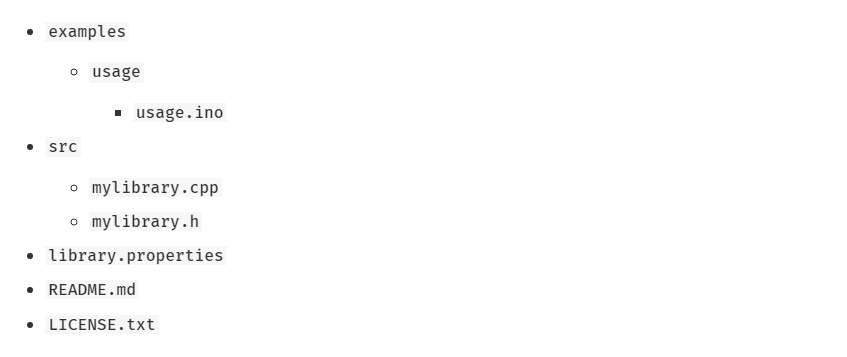

# Creating Libraries
A library is a set of functions related to a specific purpose. We all use libraries and in many occasions, can’t find the libraries we need. Particle libraries can include and depend on other libraries which makes them very useful. This tutorial will discuss the structure of a library and will illustrate the steps on how to create one.  

### Types of Libraries
- **Public Libraries:** These libraries are available for anyone to use in the Particle environment through the development tools and via their Library API. These are developed by the Particle community.
 - **Official Libraries:** The libraries created by the particle team specifically for Particle hardware are the official libraries.
 - **Verified Libraries:** These libraries have been created by someone from the Particle community and have been reviewed by the Particle team. These libraries are well-documented, debugged and perform as intended.
- **Private Libraries:** Libraries which have been uploaded to the Particle Cloud but are only visible to the individual who created them.

### Library Structure
The library requires to be in a structure for legibility purposes. The following is what is generally used. 


The example folder contains a code snippet which uses the library. It should be a working example which illustrates how to use the code

The src folder contains the actual libraries. The crux of the library is contained in the src/lib_name.cpp and src/lib_name.h. The convention is that .h files are declarations, and .cpp files are definitions which is why we include .h files in our code.

A license.txt is needed by public libraries for distribution and defines the license

The library.properties describes the library and specifies other libraries your library depends on. The fields that it contains are: 

1. **name:** A short name which MUST be unique.
2. **version:**  The Semantic Versioning number like 1.0.0.
3. **author:**  Your name and some contact information. If there are several authors, separate them using commas.
4. **license:**  The acronym of the license it is released under.
5. **Sentence:**  A one liner about the library shown in the browser.
6. **paragraph:** A longer description which can be viewed in the details page.
7. **url:** The website with more information about the library.
8. **repository:**  The github location of the library.
9. **architectures:** A list of compatible hardware boarded, comma-separated.
10. **dependencies:** The other libraries this one depends on. One line for each library who’s value is the version of that library.
11. **whitelist:** A list of files to include when publishing the library.

### Finally – Creating The Library!
Libraries are created using the CLI (Command Line Interface). After opening the CLI, there are a few ways one can create a library
````
$ particle library create 
````
This generates a new  and empty library. You can also download a . Once you’ve downloaded it, go into the folder using the CLI and rename it as shown below
````
$ particle library init this-is-my-library-name
````
If you’ve made libraries before, you can also migrate it to a new format using the following
````
$ particle library migrate
````
You can also edit an existing particle or arduino library by forking the code from GitHub. Lastly, using the CLI, you can download an existing library using the code
````
$ particle library view <library_name>

````
### Publishing The Library
Once you’ve created the library, you can edit the code of the library using the IDE or even on GitHub. Write an example using the library and test it. Once everything is ready to go, you can send your library up to the cloud in the IDE with “Upload library” or through the CLI from the library folder by typing
````
$ particle library upload
````
You can also create a GitHub repo and push the files to it. After that you need to validate the library by in CLI using
````
$ particle library validate
````

This version is private and still needs to be published. You can publish it through the desktop IDE or by typing the following in the CLI
````
$ particle library publish <my_lib> 
````  
### Resources
There is an example library in the folder. More information about libraries can be found [here](https://docs.particle.io/guide/tools-and-features/libraries/#contributing-libraries).
