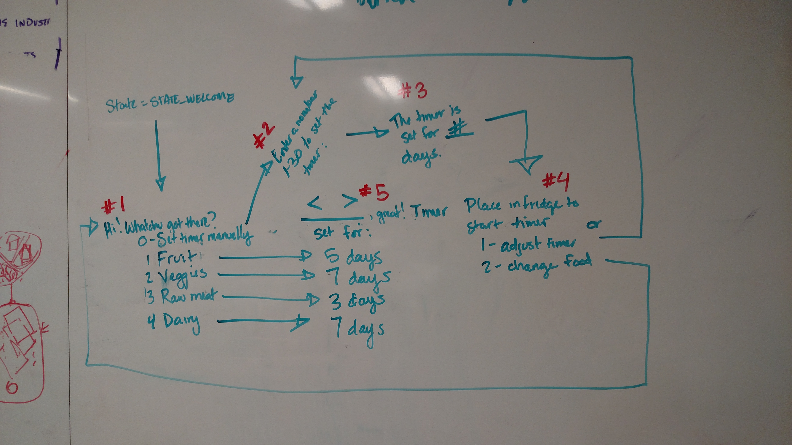

# Experience Map
### Meet Smartware
Your smart tupperware! Food freshness with confidence.

#### HOW IT WORKS

 - The user switches the device on and neopixel breathes white light.
 - User sets timer through text messaging and the lights blink blue (int times based on # of days set).
 - To start the timer, just put the tupperware in the fridge. It will start once the temperature drops below 40F.
 - The next time you open the fridge, you'll be sure not to miss your tupperware at the back of the fridge 
 - The countdown will show how much time you have to eat it.
 - Once time is up, the neopixel blinks yellow. If at any point, the VOC gas reading goes above a 600, the neopixel will flash red until the dish is removed from the fridge.
 - The device automatically turns off when the tupperware temperature sensor is >50F for more than 30 mins.

#### DEMO ADJUSTMENTS 
For the purposes of the demo, some duration adjustments were made.
 
 - In the demo version, "Days" are converted to minutes
 - Counter starts when temperature is <60F
 - Shut off triggered if temp >75F, no time delay
 - Depending on exterior encasement, red light may need to change to white (blue encasement, for example, made red look blue)
 
### Smart Container Product Backlog
| Priority |                           Description                               |           Notes          |
|----------|---------------------------------------------------------------------|--------------------------|
|    P0    | Ambient UX for various states (Wait, Start, Countdown, Off)         | Must. Basic functionality.
|    P0    | Product shut off triggered by temperature > 60F for >3-4 hours)     | Must. Basic functionality.
|    P0    | Create a fixed countdown duration time                              | Temporary feature.
|    P1    | Set countdown duration time dynamically using the ROTARY            | Temporary feature.
|    P1    | Design a removeable / waterproof housing for electronics	         | Must. Basic functionality.
|    P2    | Add VOC gas sensors to monitor food freshness                       | Advanced feature. Nice to have.
|    P2    | Set countdown duration time dynamically using the VOC GAS SENSOR    | Advanced feature. Nice to have.
|    P3    | Add "assign to me" and text reminder through ifttt                  | UX. Nice to have.
