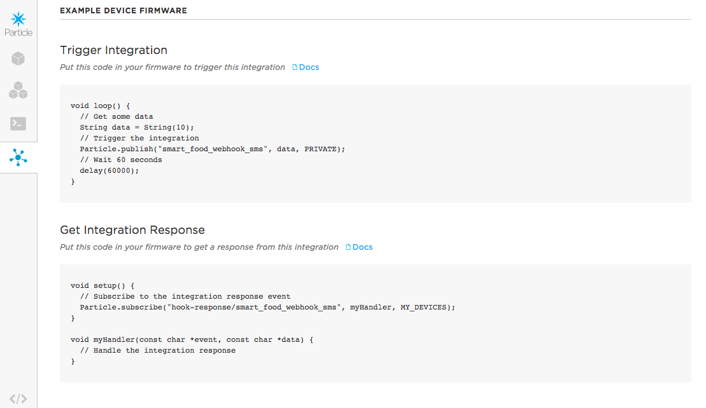

# Research Sprint 3
## Connectivity and Preferences Research

### Summary

Since the potentiometer is likely to expose the electronics to liquid, I looked into digital options for setting the timer duration and decided to integrate with SMS using Twilio.

### Findings & Application to Smartware

 - [Particle Webhooks](https://docs.particle.io/guide/tools-and-features/webhooks/) only work with Twilio to push SMS messages. See image below for basic structure of my POST webhooks.
 - To read SMS messages sent to the Twilio phone number, you need to set up a web server. I ended up using Heroku as that's what I'm most familiar with, but someone from the Particle Community recommended the following:
          Twilio webhook -> AWS APIGateway (which can be tricky to setup) -> AWS Lambda function -> Particle API -> Particle Device.
          Not sure what programming languages you are comfortable with but if you know NodeJS:
          - AWS Lambda will run NodeJS functions
          - There is a NodeJS module for Twilio
          - There is a NodeJS module for the Particle API
 - Using my previous experience working with Ruby, Twilio, and Heroku, I was able to create a Ruby app with the desired interactions. See this [Ruby Gem](https://github.com/monkbroc/particlerb) for details on integrating Ruby with Particle.
 - The Photon was able to subscribe to events triggered by the SMS messages through the above integration, creating a seemless experience for both outgoing and incoming SMS messages.

