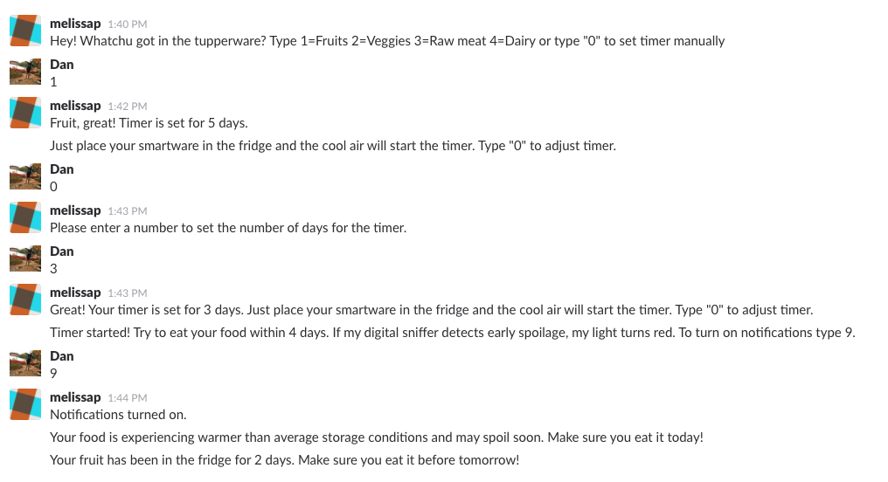

# Final Sprint
## Usability Findings

### Summary

The purpose of the usability test was to test the SMS user interaction to make sure the messages were intuitive and provided necessary and desired information.

### Findings

 - Participants did not prefer using the preset options. This feature has been removed. One wanted to track soup and another was willing to select a pre-set option, but mostly to see what the UX was.
 - To teach users proper storage durations, helpful tips have been added during the countdown state.
 - Half of the participants reported that they don't waste food and usually eat food within one day. Per user testing, this is a common response. You don't forget to eat your leftovers until you forget to eat them! For this reason, getting the VOC gas sensor to automatically monitor food for spoilage rather than having any manual entry is the ideal target state.
 - Giving raw gas and temperature readings was confusing to users and only added concern about food freshness, which can lead to more food waste. Gas readings are only shared with users when it surpasses extreme limits and temperature readings will only be used by the device to start and stop the timer.
 - A warning that gas levels of a food has exceeded safe limits is useful if the user feels confident this reading is accurate.
 
 