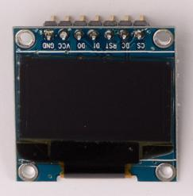
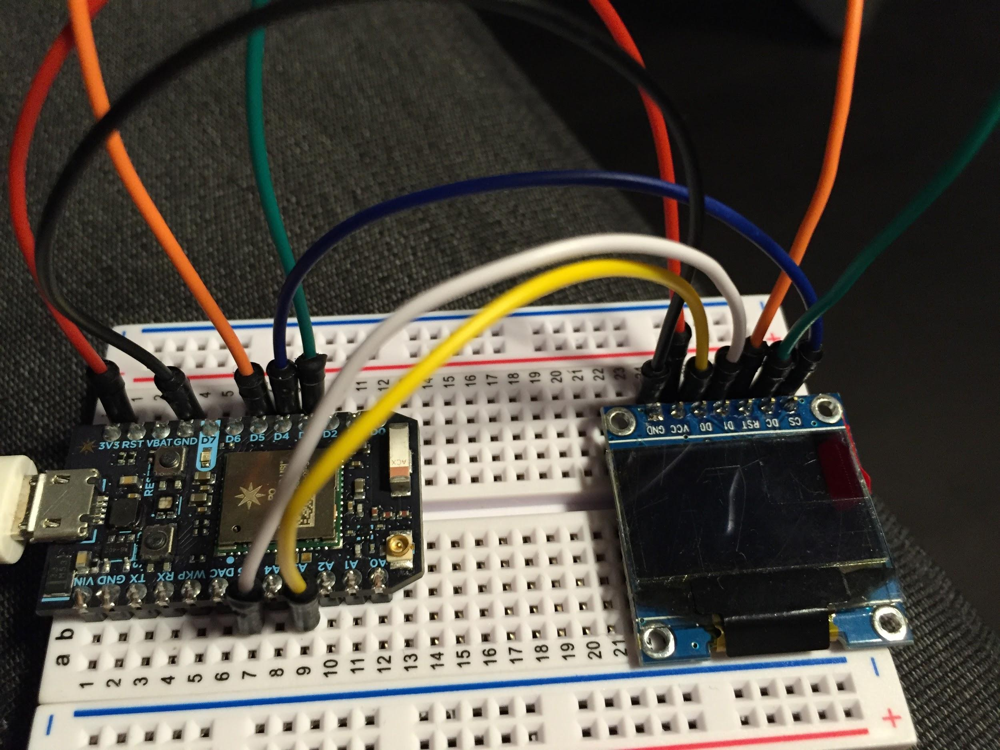

# Tutorial: Working with the serial OLED

Each of your particle Maker kits contains 1 [0.96" serial Oled Screen](https://docs.particle.io/datasheets/photon-shields/#serial-oled-screen-0-96-quot-1-) (see image). It has a series of pins for power, ground and control. The screen contains 128x64 pixels and can be controlled by the [SPI](https://learn.sparkfun.com/tutorials/serial-peripheral-interface-spi) (default) or [I2C](https://learn.sparkfun.com/tutorials/i2c) interfaces. The screen in your kits is a monochrome (white on black text) but OLEDs also come in RGB (full color) version too; and you can buy them in a variety of shapes and sizes. To learn more take a look at the [datasheet](https://docs.particle.io/assets/datasheets/makerkit/oled.pdf) 

There’s a fantastic guide on the Particle community forums on working with the OLED in your kit and this should be a first read: **[https://community.particle.io/t/getting-started-with-the-maker-kit-oled-how-to/1589**7](https://community.particle.io/t/getting-started-with-the-maker-kit-oled-how-to/15897)**



## What’s an OLED good for:

An OLED lets you create anything you could put on the screen of a computer. The pixels are tightly packed so you get much richer outputs than an LED matrix or LED strip. The downside is that it’s more complex to control. You can

* Write text to the screen such as a status message or the current reading from a sensor

* Draw simple graphics like rectangles, squares and create compositions

* Present bitmap images to display complex icons, images or avatars. 

* Create animations and moving images.

Learn more about [OLEDs on Adafruit](https://learn.adafruit.com/monochrome-oled-breakouts/arduino-library-and-examples)

## Libraries Needed:

There are two libraries needed

* Adafruit_SSD1306

* Adafruit_GFX

They are based on original [Adafruit Library for OLEDs](https://github.com/adafruit/Adafruit_SSD1306) designed for Arduino.

Both of these have been ported to the Particle framework. Download them and add them to your project folder: [https://github.com/pkourany/Adafruit_SSD1306](https://github.com/pkourany/Adafruit_SSD1306) 

And include both in your main project file by adding the following lines to the top of your code:

````
#include "Adafruit_SSD1306/Adafruit_GFX.h"
#include "Adafruit_SSD1306/Adafruit_SSD1306.h"
````

## Wiring 



Wire your OLED to your Particle as show in the image above and in the list below. 

1. 3V3 --> VCC (Red)

2. GND --> GND (Black)

3. D5 --> RST (Orange)

4. D4 --> CS (Blue)

5. D3 --> DC (Green)

6. A5 --> D1 (White)

7. A3 --> D0 (Yellow)

## Working with the Library

There’s tonnes you can do but putting text on the screen is incredibly easy and useful.

The first command you need to know is clearDisplay() is wipes the screen and resets it. If you don’t use it, any subsequent commands become overlaid on what is already on the screen. 

````
display.clearDisplay();   // clears the screen and buffer
````

Then you can write text like this

````
  display.setTextSize(2);  		// set the text size - this can be from 1 (small) to 9 (huge)

  display.setTextColor(WHITE);	// write white text on a black background or… 

  // display.setTextColor(BLACK, WHITE); // 'inverted' text, black on white background

  display.setCursor(0,0);		// move the start position for the text to the top left

  display.println("Welcome");		// write the text to the screen

  display.display();			// then display your message / tell the screen to refresh with the new information 
````

## Showing Bitmaps / Images

You can also display Bitmap images on the display. This is written up in detail [in this guide on AdaFruit](https://learn.adafruit.com/monochrome-oled-breakouts/arduino-library-and-examples) or this one on [Sparkfun](https://learn.sparkfun.com/tutorials/graphic-lcd-hookup-guide/example-code-2-drawing-bitmaps)

*The basics are:*

1. Create a monochrome (single color) bitmap in Photoshop and make sure the width and height matches the size and settings for your OLED screen (i.e. 128 x 64)

2. Save the file as BMP in Windows format with 1 bit depth

3. If you’re on Windows use [LCD Assistant](http://en.radzio.dxp.pl/bitmap_converter/). If you’re on OSX download [bitmapToC ](https://github.com/hoiberg/bitmapToC)(see the releases tab). Then import the Bitmap file and get a lovely character array. 

4. Copy and paste the char array into your main code file. 

5. Use display.drawBitmap to add your bitmap (see code example)

## Graphics Examples

Take a look at the code in Week_2’s folder for an example of preparing graphics and animations for OLEDs

